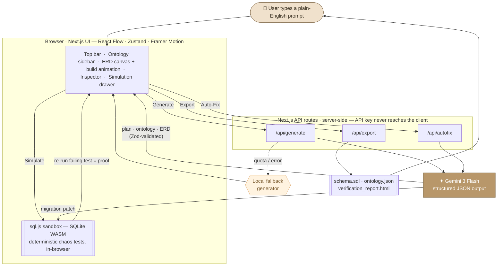

# Episteme — AI-Powered Database Schema Builder

> Turn plain-English requirements into verified, production-grade database systems. Powered by Gemini 3.

**[Live Demo](https://episteme-one.vercel.app)** · [Architecture](./ARCHITECTURE.md) · [Gemini Prompts](./GEMINI_PROMPTS.md)

---

## What It Does

Episteme transforms a natural-language description into a complete database system — not just a diagram. Type _"build an inventory management system for a sneaker brand"_ and Gemini 3 constructs an ontology, generates tables and relationships, and lays out an interactive ERD with a live build animation. You can then **stress-test the schema** with adversarial chaos tests that run in an in-browser SQLite sandbox, let Gemini **auto-heal** the failures with verified migration patches, and **export** the whole thing as a bundle.

**This is not a chat interface.** Gemini 3 is embedded as the engine of a real tool.

---

## Key Features

- **AI schema generation** — one structured Gemini 3 call turns a prompt into a full plan → ontology → ERD → build script, validated end-to-end with Zod.
- **Live build animation** — watch tables, columns, and relationships assemble on a Lucidchart-style canvas, choreographed client-side from Gemini's build script.
- **Palantir-inspired ontology** — object types, link types, and action types with preconditions, transaction plans, and side effects.
- **Chaos testing** — automated adversarial tests (duplicate keys, NULL violations, orphaned foreign keys, CHECK violations) executed in an in-browser SQLite sandbox — no server required.
- **Self-healing schema** — failed tests are sent back to Gemini, which proposes minimal migration patches that are applied in the sandbox and re-run for proof.
- **Interactive ERD canvas** — drag, zoom, pan, select, inspect, and draw your own relationships with React Flow.
- **Session persistence** — your generated schema is saved to `localStorage`, so a refresh doesn't lose your work.
- **One-click export** — SQL schema, ontology JSON, and an HTML verification report as a downloadable ZIP.
- **Graceful degradation** — a quota-aware local fallback generator keeps the app fully usable even when the Gemini free tier is rate-limited.

---

## Tech Stack

| Layer | Technology | Purpose |
|-------|-----------|---------|
| Framework | Next.js 16 (App Router) | SSR, API routes, Vercel-native deployment |
| AI Engine | Gemini 3 Flash (`@google/genai` SDK) | Structured JSON outputs |
| Canvas | React Flow (`@xyflow/react` v12) | Interactive ERD with custom nodes/edges |
| State | Zustand | Lightweight state management + persistence |
| DB Sandbox | sql.js (SQLite WASM) | In-browser schema testing, no server needed |
| Validation | Zod | Type-safe structured-output schemas |
| Animation | Framer Motion | Build-playback choreography |
| Styling | Tailwind CSS v4 | Warm, editorial light theme |
| Testing | Vitest | Unit tests for the core generation/verification logic |
| Deployment | Vercel (free tier) | Zero-config HTTPS deployment |

All technologies are free and open source. No paid APIs or hosting required.

---

## How Gemini 3 Is Used

Episteme uses Gemini 3 Flash at two points in the pipeline, both server-side (the API key is never exposed to the browser):

### 1. Schema generation — structured output
A single call to `/api/generate` sends the user's prompt plus a detailed instruction schema and asks Gemini to return **one JSON document** containing the plan, ontology, and ERD. The response uses `responseMimeType: "application/json"` and is validated with Zod before it ever reaches the UI. The build-animation script is then derived deterministically from that ERD. If Gemini returns malformed or unexpected JSON, the route falls back to a deterministic local generator instead of failing.

### 2. Self-healing — AI migration patches
When a chaos test fails, `/api/autofix` sends Gemini the failing test, the error, and the current schema, and asks for a **minimal, targeted migration** (an `ALTER TABLE`, `CREATE INDEX`, or `CREATE TRIGGER` — the sandbox is SQLite-compatible). Each patch is applied in the sql.js sandbox and the failing test is re-run to **prove** the fix before it's accepted.

### Verification is deterministic and client-side
Chaos tests are **not** generated by the LLM — they're derived deterministically from the ERD's constraints and executed locally in sql.js. This keeps verification fast, free, and reproducible.

### Graceful degradation
The Gemini client tracks quota/rate-limit responses (`429` / `RESOURCE_EXHAUSTED`), applies a short local cooldown, and lets both routes fall back to local generation/patching so the demo never hard-fails.

---

## Architecture



**In one line:** the browser calls three server routes — `/api/generate` (Gemini structured output, with a local fallback), `/api/autofix` (Gemini migration patches), and `/api/export` (ZIP bundle) — while all **verification runs in the browser** via a sql.js SQLite sandbox. See [ARCHITECTURE.md](./ARCHITECTURE.md) for the full data flow.

---

## Ontology Model

Inspired by [Palantir Foundry's Ontology](https://www.palantir.com/platforms/foundry/):

| Concept | Description |
|---------|-------------|
| **Object Types** | Real-world entities mapped to database tables |
| **Link Types** | Semantic relationships with explicit cardinalities |
| **Action Types** | First-class operations with preconditions, transaction plans, and side effects |
| **Interfaces** | Shared behaviors across entities (Auditable, Transferable, Addressable) |

---

## Local Development

### Prerequisites
- Node.js 18.18+
- npm

### Setup

```bash
git clone https://github.com/BhavyaAk25/Episteme.git
cd Episteme
npm install
cp .env.example .env.local   # then add your Gemini API key
```

### Environment Variables

`.env.local`:

```
GEMINI_API_KEY=your_gemini_api_key_here
GEMINI_MODEL=gemini-3-flash-preview
```

Get a free key at [Google AI Studio](https://aistudio.google.com/apikey). `GEMINI_MODEL` is optional (defaults to `gemini-3-flash-preview`) but recommended in production so deployments stay explicit and reproducible. Without a key, the app still runs entirely on the local fallback generator.

### Run

```bash
npm run dev        # start the dev server at http://localhost:3000
npm run lint       # eslint
npm run typecheck  # tsc --noEmit
npm test           # vitest unit tests
npm run build      # production build
```

---

## Testing

Core generation and verification logic is covered by [Vitest](https://vitest.dev) unit tests:

- `src/lib/ontology/transformer.test.ts` — ERD → SQL / nodes / edges
- `src/lib/simulation/sqlGenerator.test.ts` — PostgreSQL → SQLite schema generation
- `src/lib/simulation/chaosTests.test.ts` — deterministic adversarial test generation
- `src/lib/gemini/fallbackGeneration.test.ts` — domain classifier, fallback integrity, and the replay-script contract

```bash
npm test
```

---

## Deployment

Standard Next.js — deploy to Vercel:

1. Import the GitHub repo at [vercel.com/new](https://vercel.com/new).
2. Set environment variables: `GEMINI_API_KEY` (required), `GEMINI_MODEL` (recommended).
3. Deploy — Vercel auto-detects Next.js.

The `sql-wasm.js` and `sql-wasm.wasm` files in `public/` are served as static assets automatically. If Gemini is unavailable or rate-limited, `/api/generate` returns a local fallback schema with warning metadata instead of failing.

---

## Project Structure

```
episteme/
├── src/
│   ├── app/
│   │   ├── page.tsx            # Main application page
│   │   ├── layout.tsx          # Root layout
│   │   ├── globals.css         # Global styles + Tailwind
│   │   └── api/
│   │       ├── generate/       # Gemini schema generation (+ local fallback)
│   │       ├── autofix/        # Gemini self-healing patches
│   │       └── export/         # Export bundle (ZIP)
│   ├── components/
│   │   ├── canvas/             # ERD visualization + build animation (React Flow)
│   │   ├── sidebar/            # Ontology explorer + templates
│   │   ├── inspector/          # Entity detail panel
│   │   ├── topbar/             # Controls, prompt input, phase progress
│   │   ├── simulation/         # Chaos-test drawer, incidents, patch diffs
│   │   ├── export/             # Export modal
│   │   └── shared/             # Status tags, loading states
│   ├── lib/
│   │   ├── gemini/             # Client, prompts, Zod schemas, local fallback
│   │   ├── ontology/           # ERD ↔ React Flow + SQL transformers
│   │   └── simulation/         # sql.js sandbox, seeding, chaos tests, auto-fix
│   ├── store/                  # Zustand stores (project, canvas, simulation, UI)
│   └── types/                  # Shared TypeScript types
├── public/                     # Brand assets + sql.js WASM runtime
├── ARCHITECTURE.md             # System architecture
├── GEMINI_PROMPTS.md           # All Gemini system prompts
└── README.md
```

---

## License

MIT
